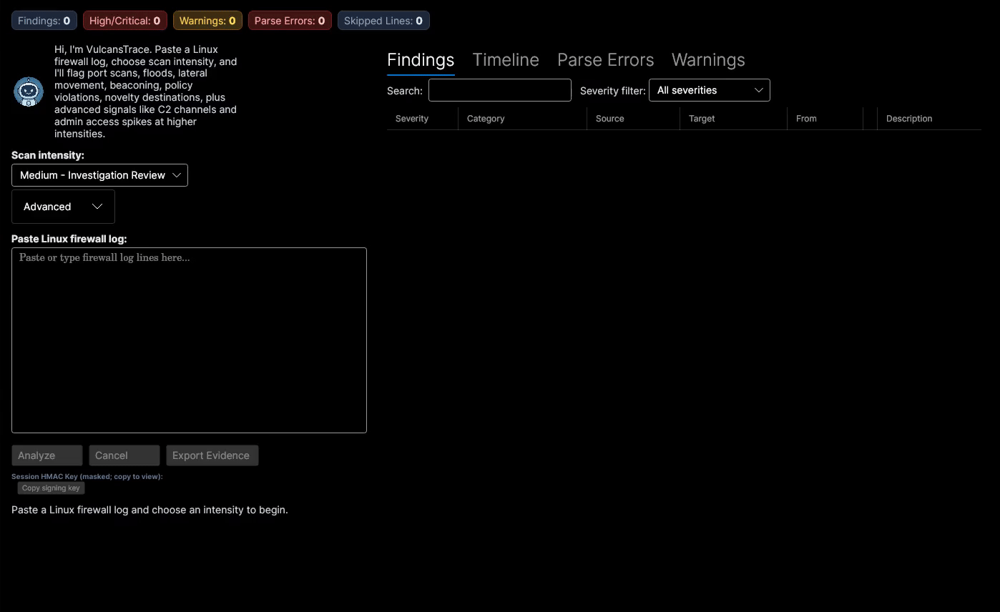

# VulcansTrace Linux Edition

[](https://github.com/MVulcansTrace/VulcansTrace_Linux_Edition/actions/workflows/ci.yml?query=branch%3Amain)
[](LICENSE)


VulcansTrace Linux Edition is an offline desktop forensic analyzer for Linux firewall logs. It parses iptables and nftables log text, normalizes it into a shared event schema, runs layered threat detectors, correlates related findings, and exports signed evidence bundles for investigation and handoff.

OFFLINE POLICY: the application does not send logs, telemetry, analytics, or findings anywhere. Logs are processed locally in memory, and evidence bundles are written only to user-selected files.

## Demo Preview



## Contents

- [Demo Preview](#demo-preview)
- [What It Does](#what-it-does)
- [Detection Coverage](#detection-coverage)
- [Quick Start](#quick-start)
- [Evidence Bundles](#evidence-bundles)
- [Project Layout](#project-layout)
- [Documentation Guide](#documentation-guide)
- [Portfolio Deep Dives](#portfolio-deep-dives)
- [Development](#development)
- [Security Notes](#security-notes)
- [License](#license)

## What It Does

VulcansTrace is built for local investigation of Linux firewall telemetry:

- Accepts iptables kernel logs and nftables `nf_tables:` entries.
- Handles mixed-format log input by classifying lines individually.
- Converts raw log lines into `UnifiedEvent` records with shared fields and Linux-specific metadata.
- Runs baseline, Linux-specific, and advanced threat detectors.
- Escalates severity when correlated behavior appears on the same source host.
- Preserves parse errors, skipped lines, warnings, and detector output for analyst review.
- Exports reports in CSV, JSON, STIX 2.1, HTML, Markdown, and signed manifest formats.
- Provides a local Security Agent that answers plain-English posture questions using live host scanners, deterministic rules, role-aware local policy, and dual-layer CIS Benchmark mapping (CIS Controls v8 + CIS Ubuntu 24.04 LTS technical controls) for audit-ready compliance traceability — including interactive, step-by-step guided remediation for individual findings with safety-classified commands and rollback visibility, plus batch auto-fix with dry-run preview for headless remediation.
- File Permission Auditing — checks `/etc/shadow`, `/etc/passwd`, SSH host private keys, user and root SSH directories, cron directories, and `/etc/crontab` for overly permissive permissions or incorrect ownership.
- Filesystem Auditing — hunts broadly for world-writable files outside expected paths, unexpected SUID/SGID binaries, unowned files, world-writable directories without sticky bit, and `/tmp` mount hardening (`noexec`, `nosuid`, `nodev`).
- User & Account Auditing — checks UID 0 beyond root, empty password hashes, password aging from `/etc/login.defs` and shadow entries, PAM password complexity, inactive accounts, duplicate UIDs, and missing home directories.
- Configuration Baseline & Drift Detection — snapshot a "known good" baseline and continuously monitor for drift.
- **Recurring Audit Scheduling** — configure automatic recurring audits (daily, weekly, etc.) via standard Linux `cron`. Notifications are sent only when **new** critical findings appear, using fingerprint-aware diffing against previous audit history.
- **Headless CLI** — run audits and manage schedules from the command line without launching the desktop UI.
- **CIS Compliance Scorecard** — formal pass/fail/warn per control family, overall percentage score, and trend over time, readable in 10 seconds by managers and auditors. Included in the Avalonia UI and evidence exports.
- **Multi-channel Notifications** — Desktop (`notify-send`), Email (SMTP), and Webhook (HTTP POST) channels for critical-finding alerts.

The desktop app is implemented with Avalonia and targets .NET 9.0.

## Detection Coverage

Baseline network detectors:

- Port scan detection
- Flood / denial-of-service burst detection
- Lateral movement detection
- Beaconing detection
- Policy violation detection
- Novelty detection

Linux deep-inspection detectors:

- TCP flag anomaly detection
- MAC spoofing detection
- Kernel module / firewall capability indicators
- Interface hopping detection
- Unusual packet size detection

Advanced detectors and correlation:

- C2 channel detection
- Privilege escalation indicators from suspicious admin-port access
- Risk escalation for correlated findings such as Beaconing + LateralMovement, FlagAnomaly + PortScan, and MacSpoofing + InterfaceHopping

## Quick Start

Prerequisites:

- .NET 9.0 SDK
- Linux desktop environment for running the Avalonia UI

Build the solution:

```bash
dotnet build
```

Run the desktop app:

```bash
dotnet run --project VulcansTrace.Linux.Avalonia
```

Run the test suite:

```bash
dotnet test
```

Run the optional CLI analysis tool against a sample log:

```bash
dotnet run --project tools/TestAnalysis -- VulcansTrace.Linux.Tests/Data/Real/Samples/iptables-attack.log
```

Run performance tooling:

```bash
dotnet run --project VulcansTrace.Linux.PerformanceConsole
dotnet run --project VulcansTrace.Linux.PerformanceConsole -- profile
```

Run a headless audit via CLI:

```bash
dotnet run --project VulcansTrace.Linux.Cli -- audit --intent FullAudit --role Server
```

Preview and apply automatic remediation after an audit:

```bash
# Dry-run: see what would change without executing
dotnet run --project VulcansTrace.Linux.Cli -- audit --intent FullAudit --auto-fix --dry-run

# Apply safe fixes with confirmation
dotnet run --project VulcansTrace.Linux.Cli -- audit --intent FullAudit --auto-fix --yes

# Also permit service restarts and package operations
dotnet run --project VulcansTrace.Linux.Cli -- audit --intent FullAudit --auto-fix --yes --allow-restart --allow-packages
```

Manage recurring schedules via CLI:

```bash
dotnet run --project VulcansTrace.Linux.Cli -- schedule list
dotnet run --project VulcansTrace.Linux.Cli -- schedule add --name "Daily Full Audit" --intent FullAudit --cron "0 6 * * *" --role Server --notify-on-critical --channel Desktop
```

Build a self-contained CLI binary:

```bash
./scripts/publish-cli.sh
```

For a guided product walkthrough, see [docs/DEMO.md](docs/DEMO.md).

## Evidence Bundles

The UI can export a signed ZIP evidence package containing:

| File | Purpose |
| --- | --- |
| `findings.csv` | Spreadsheet-friendly finding list |
| `findings.json` | Structured JSON output for tooling and review |
| `findings.stix.json` | STIX 2.1 bundle with observed data and notes |
| `report.html` | Human-readable HTML report |
| `summary.md` | Markdown investigation summary |
| `log.txt` | Original raw log text |
| `suppressions.csv` | Active accepted-risk suppressions, when present |
| `manifest.json` | File hashes, parse metadata, skipped lines, and bundle metadata |
| `manifest.hmac` | HMAC-SHA256 signature over the manifest |
| `compliance-scorecard.html` | Manager-friendly HTML compliance scorecard (Pass/Warn/Fail per CIS family, overall score, trend) |
| `compliance-scorecard.md` | Markdown compliance scorecard for Git-based workflows |

The signing key is generated per completed analysis session and shown in the UI masked by default. Re-running analysis creates a new key; repeated exports of the same result reuse the session key. Keep the copied key with the case record if later verification is required.

The optional CLI runner can verify an exported bundle with that key:

```bash
dotnet run --project tools/TestAnalysis -- --verify evidence.zip --key <64-character-hex-key>
```

Evidence documentation:

- [HMAC evidence signing key flow](docs/HMAC_EVIDENCE.md)
- [Evidence packaging portfolio](docs/portfolio/09-Evidence-Packaging/README.md)
- [Security and offline policy](docs/SECURITY.md)

## Project Layout

| Path | Description |
| --- | --- |
| `VulcansTrace.Linux.Core` | Domain models, `UnifiedEvent`, log normalization, iptables/nftables parsers, and logging abstractions |
| `VulcansTrace.Linux.Engine` | Detector implementations, intensity profiles, `SentryAnalyzer`, and risk escalation |
| `VulcansTrace.Linux.Evidence` | Evidence bundle generation and CSV, JSON, STIX, HTML, and Markdown formatters |
| `VulcansTrace.Linux.Agent` | Local Security Agent, scanners, posture rules, role-aware policy, explanations, and agent report adapter |
| `VulcansTrace.Linux.Avalonia` | Desktop UI, ViewModels, commands, and dialog services |
| `VulcansTrace.Linux.Cli` | Headless CLI for audits, schedule management, and cron integration |
| `VulcansTrace.Linux.Tests` | xUnit unit, integration, detector, evidence, UI, and performance tests |
| `VulcansTrace.Linux.Performance` | Benchmark and profiling helpers |
| `VulcansTrace.Linux.PerformanceConsole` | Console runner for benchmark and profiling workflows |
| `tools/TestAnalysis` | Optional CLI runner for direct log-file analysis and evidence export checks |
| `docs` | Architecture, usage, security, development, demo, and portfolio documentation |
| `scripts` | Developer and internal build-support scripts |

## Documentation Guide

Start here depending on what you need:

| Document | Use It For |
| --- | --- |
| [docs/USAGE.md](docs/USAGE.md) | How to run the app, analyze logs, review findings, and export evidence |
| [docs/DEMO.md](docs/DEMO.md) | A guided walkthrough using sample firewall logs |
| [docs/ARCHITECTURE.md](docs/ARCHITECTURE.md) | System layers, data flow, detector groups, and domain types |
| [docs/DEVELOPMENT.md](docs/DEVELOPMENT.md) | Build/test workflow, project layout, detector extension steps, and build policies |
| [docs/SECURITY.md](docs/SECURITY.md) | Offline policy, local data handling, evidence integrity, and defensive parsing |
| [docs/SECURITY_AGENT.md](docs/SECURITY_AGENT.md) | Local Security Agent capabilities, scanner pipeline, rules, limitations, and roadmap |
| [docs/HMAC_EVIDENCE.md](docs/HMAC_EVIDENCE.md) | How session signing keys are generated, copied, and used for verification |
| [docs/CHANGES_AND_PROFILES.md](docs/CHANGES_AND_PROFILES.md) | Implementation change summary and Low/Medium/High profile capabilities |
| [docs/portfolio/README.md](docs/portfolio/README.md) | GitHub-facing index for the complete technical portfolio |

Recommended review paths:

- For usage: [Usage](docs/USAGE.md) -> [Demo](docs/DEMO.md) -> [Evidence signing](docs/HMAC_EVIDENCE.md)
- For architecture: [Architecture](docs/ARCHITECTURE.md) -> [Log Normalization](docs/portfolio/01-Log-Normalization/README.md) -> [Intensity Profiles](docs/portfolio/10-Intensity-Profiles/README.md)
- For detection engineering: [Port Scan Detection](docs/portfolio/02-Port-Scan-Detection/README.md) -> [Beaconing Detection](docs/portfolio/03-Beaconing-Detection/README.md) -> [C2 Channel Detection](docs/portfolio/13-C2-Channel-Detection/README.md)
- For investigation workflow: [Risk Escalation](docs/portfolio/08-Risk-Escalation/README.md) -> [Evidence Packaging](docs/portfolio/09-Evidence-Packaging/README.md) -> [Avalonia UI](docs/portfolio/12-Avalonia-UI/README.md)
- For local assistant workflow: [Security Agent](docs/SECURITY_AGENT.md) -> [Security Agent portfolio](docs/portfolio/16-Security-Agent/README.md) -> [Avalonia UI](docs/portfolio/12-Avalonia-UI/README.md)
- For scheduling and automation: [Usage](docs/USAGE.md) -> [Changes](docs/CHANGES_AND_PROFILES.md) -> [Security](docs/SECURITY.md)
- For verification: [Automated Tests](docs/portfolio/11-Automated-Tests/README.md) -> [Development](docs/DEVELOPMENT.md) -> [Security](docs/SECURITY.md)

## Portfolio Deep Dives

The `docs/portfolio` folder contains 16 implementation-focused case studies. Each topic includes a `README.md`, concise summary material, and deeper technical notes such as algorithms, design decisions, evasion limits, MITRE ATT&CK mapping where relevant, and code-pattern walkthroughs.

| Topic | Description |
| --- | --- |
| [01 - Log Normalization](docs/portfolio/01-Log-Normalization/README.md) | iptables/nftables parsing, timestamp handling, schema normalization, and log-management tradeoffs |
| [02 - Port Scan Detection](docs/portfolio/02-Port-Scan-Detection/README.md) | Distinct-port scan detection, thresholds, grouping, and detector behavior |
| [03 - Beaconing Detection](docs/portfolio/03-Beaconing-Detection/README.md) | Periodic communication analysis and interval-based signal detection |
| [04 - Lateral Movement Detection](docs/portfolio/04-Lateral-Movement-Detection/README.md) | Internal movement patterns across hosts and ports |
| [05 - Flood Detection](docs/portfolio/05-Flood-Detection/README.md) | High-volume burst detection for flood and DoS-style behavior |
| [06 - Policy Violation Detection](docs/portfolio/06-Policy-Violation-Detection/README.md) | Disallowed service and policy-boundary detection |
| [07 - Novelty Detection](docs/portfolio/07-Novelty-Detection/README.md) | Rare or unexpected connection pattern detection |
| [08 - Risk Escalation](docs/portfolio/08-Risk-Escalation/README.md) | Correlation rules that raise severity when related findings appear together |
| [09 - Evidence Packaging](docs/portfolio/09-Evidence-Packaging/README.md) | Signed evidence bundles, report formats, manifest hashing, and integrity workflow |
| [10 - Intensity Profiles](docs/portfolio/10-Intensity-Profiles/README.md) | Low, Medium, and High profile thresholds, detector enablement, and tuning tradeoffs |
| [11 - Automated Tests](docs/portfolio/11-Automated-Tests/README.md) | Unit, integration, fixture, cancellation, performance, and evidence-verification coverage |
| [12 - Avalonia UI](docs/portfolio/12-Avalonia-UI/README.md) | Desktop analyst workflow, ViewModel structure, commands, tabs, and export UX |
| [13 - C2 Channel Detection](docs/portfolio/13-C2-Channel-Detection/README.md) | Periodic command-and-control channel detection and grouping behavior |
| [14 - Privilege Escalation Detection](docs/portfolio/14-Privilege-Escalation-Detection/README.md) | Admin-port spikes and sweeps as privilege-escalation indicators |
| [15 - Linux Deep Inspection](docs/portfolio/15-Linux-Deep-Inspection/README.md) | Linux-specific signals including flags, MACs, kernel modules, interfaces, and packet sizes |
| [16 - Security Agent](docs/portfolio/16-Security-Agent/README.md) | Local rule-based assistant for live Linux posture questions, role-aware policy, scanner orchestration, explanations, interactive remediation, and configuration baseline / drift detection |

## Development

Common commands:

```bash
dotnet restore VulcansTrace.Linux.sln
dotnet build VulcansTrace.Linux.sln --configuration Release
dotnet test VulcansTrace.Linux.sln --configuration Release
```

GitHub Actions runs restore, Release build, and the deterministic test set. Tests marked `Category=Performance` or `Category=Timing` are kept out of hosted CI because benchmark thresholds and millisecond cancellation races are runner-sensitive; run the full suite locally when validating performance changes.

To add a detector, implement `IDetector`, register it with the analyzer composition root, add focused detector tests, update profile thresholds if needed, and document the behavior in the relevant portfolio section. See [docs/DEVELOPMENT.md](docs/DEVELOPMENT.md) for the detailed checklist.

## Security Notes

- The app has no built-in network calls for log analysis, telemetry, or reporting.
- `nuget.config` points to the public nuget.org feed for restore.
- Log input is capped at 100,000,000 characters.
- Retained parse errors are capped to keep analysis output bounded.
- Evidence files are protected by SHA-256 hashes and an HMAC-SHA256 manifest signature.

See [docs/SECURITY.md](docs/SECURITY.md) for the full security model.

## License

This repository is licensed under the terms in [LICENSE](LICENSE). Additional attribution and notice information is available in [NOTICE](NOTICE).
